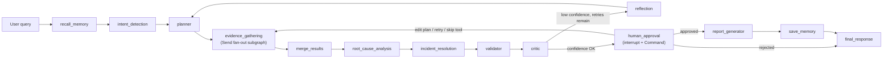

# Enterprise Incident Resolution Agent

A production-grade, multi-agent **LangGraph** system that acts as an AI
Site Reliability Engineer: it investigates infrastructure incidents
(Kubernetes, Kafka, PostgreSQL, Redis, HTTP services) end-to-end --
intent detection, planning, parallel evidence gathering, root-cause
analysis, validation, critique, human-in-the-loop approval, and
incident-report generation -- with full checkpointing, memory, and
observability.

> Built incrementally, phase by phase, over twelve phases. See
> [`docs/PHASES.md`](docs/PHASES.md) for the full build log --
> what/why/LangGraph-concepts/interview-framing for every phase,
> including two real LangGraph framework gotchas this project found and
> fixed along the way.

## Example queries

- "My Kubernetes deployment keeps restarting."
- "Kafka brokers are down."
- "My PostgreSQL database is slow."
- "Application returns HTTP 500 after deployment."
- "My pod cannot connect to Redis."

## Tech stack

Python 3.14 · LangGraph 1.x · LangChain 1.x · Anthropic (primary) with
OpenAI / Azure OpenAI fallback · Pydantic v2 · FastAPI · Streamlit ·
SQLite checkpointer · Chroma · Docker · LangSmith · Pytest.

## Architecture at a glance

17 agents, 13 tools, a compiled `StateGraph` with a Send-based parallel
evidence-gathering subgraph, a retry cycle bounded by a confidence
threshold, and a human-approval gate combining `interrupt()` with the
`Command` API. See [`docs/architecture.md`](docs/architecture.md) for
the layered dependency diagram,
[`docs/sequence-diagram.md`](docs/sequence-diagram.md) for a full
request-to-response trace, and
[`docs/state-diagram.md`](docs/state-diagram.md) for the graph's node
transitions.



## Project layout

```
incident_agent/
    config/         # Pydantic Settings, logging setup
    controllers/    # IncidentController -- transport/graph seam
    agents/         # 17 single-responsibility LLM agents (structured output)
    graphs/         # StateGraph + evidence subgraph + IncidentState
    nodes/          # Node callables wrapping agents/tools/memory
    edges/          # Conditional routing functions
    tools/          # 13 LangChain tools (mocked infra, RAG, SQL, REPL, ...)
    memory/         # 5 repositories + MemoryService facade
    models/         # Domain entities
    prompts/        # Versioned prompt templates, one per agent
    services/       # LLM client factory, vector store, checkpointer, mock DB
    schemas/        # LLM structured-output + API request/response models
    utils/          # Stateless helpers (ids, reducers, mock data)
    api/            # FastAPI routers + app factory
ui/                 # Streamlit front-end (talks to the API over HTTP)
tests/              # 182 tests: unit / agent / tool / graph / integration / UI
docs/               # Architecture, sequence, state diagrams + build log
data/               # Local SQLite checkpoints/memory, Chroma store (gitignored)
```

See [`docs/folder-structure.md`](docs/folder-structure.md) for a
per-directory file count and one-line responsibility for every layer.

## Getting started (local)

```bash
python3 -m venv .venv
source .venv/bin/activate
pip install -r requirements.lock.txt   # exact, verified versions
pip install -e .

cp .env.example .env   # then fill in ANTHROPIC__API_KEY at minimum

pytest                              # 182 tests, no API credentials required
python run_api.py                   # FastAPI on :8000
streamlit run ui/streamlit_app.py   # UI on :8501, talks to the API above
```

`requirements.txt` has loose major-version pins;
`requirements.lock.txt` (generated via `pip freeze`) is what's actually
verified installable together on this project's target interpreter --
prefer it unless you have a specific reason to re-resolve.

## Getting started (Docker)

```bash
cp .env.example .env   # then fill in ANTHROPIC__API_KEY at minimum
docker compose up --build
# API:  http://localhost:8000
# UI:   http://localhost:8501
```

`docker-compose.yml` runs the API and UI from one built image (the UI
service overrides the container command), with a named volume so
SQLite/Chroma data survives `docker compose down`/`up`.

## Configuration

All configuration is centralized in `incident_agent/config/settings.py`
via `pydantic-settings`, using `env_nested_delimiter="__"` so a single
`.env` populates a settings tree, e.g. `LLM__PRIMARY_PROVIDER=openai`
switches the primary model provider with no code change. See
`.env.example` for every supported variable.

## API

| Method | Path | Purpose |
|---|---|---|
| `POST` | `/incident` | Start a new investigation |
| `GET` | `/status/{thread_id}` | Current state of a run |
| `GET` | `/history?session_id=...` | Past incidents/threads for a session |
| `POST` | `/resume/{thread_id}` | Continue a run paused at a static interrupt |
| `POST` | `/approve/{thread_id}` | Approve, or approve-with-modification (draft or plan) |
| `POST` | `/reject/{thread_id}` | Reject; skips report generation |

Interactive docs at `/docs` once the server is running.

## Testing

```bash
pytest                           # everything
pytest -m unit                   # fast, no external I/O
pytest -m graph                  # exercises a compiled LangGraph graph
pytest -m integration            # full lifecycle through the real API
pytest --cov=incident_agent --cov-report=term-missing
```

No test requires API credentials or touches the real `data/` directory
-- every external dependency (LLM providers, the checkpoint database,
the memory store) has a dependency-injection seam (`nodes/agent_cache.
override_agent`, `memory/memory_service.override_memory_service`, or a
directly-constructed `tmp_path`-backed instance) that the test suite
uses instead.

## Documentation

- [`docs/architecture.md`](docs/architecture.md) -- layered architecture diagram and rationale
- [`docs/sequence-diagram.md`](docs/sequence-diagram.md) -- full request-to-response trace
- [`docs/state-diagram.md`](docs/state-diagram.md) -- the graph's node transitions
- [`docs/execution-flow.md`](docs/execution-flow.md) -- narrative walkthrough, node by node
- [`docs/folder-structure.md`](docs/folder-structure.md) -- per-directory responsibilities
- [`docs/PHASES.md`](docs/PHASES.md) -- the full incremental build log
