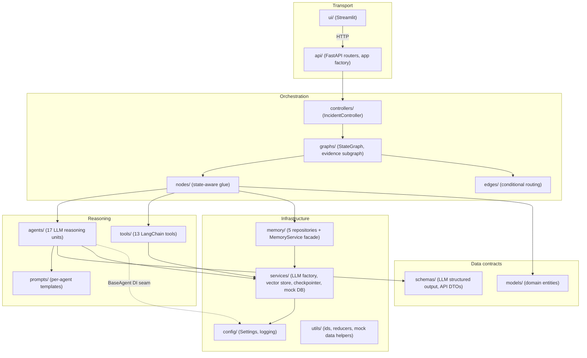

# Architecture

## Layers

Each layer depends only on layers below it. `agents/` and `tools/` never
import from `nodes/` or `graphs/`; `memory/` never imports `graphs.state`.
This is what keeps every layer independently testable (see
[`../tests/`](../tests/)).

## Why this shape

- **Agents are pure reasoning units.** `BaseAgent` (see
  [`../incident_agent/agents/base.py`](../incident_agent/agents/base.py))
  knows nothing about `IncidentState` or LangGraph -- it's `(inputs) ->
  validated Pydantic object`. `nodes/` is the only layer that translates
  between graph state and agent/tool calls. This is what lets every
  agent be unit-tested with a fake `Runnable` in Phase 4's test suite,
  with zero API credentials.
- **Structured output is the contract, not an afterthought.** Every
  agent's prompt (`prompts/`) and output shape (`schemas/`) are declared
  together; `Field(description=...)` text doubles as what the LLM sees
  during tool-calling structured output, so schema design *is* prompt
  design.
- **Provider selection is a Strategy, not an `if/elif`.**
  `services/llm_factory.py`'s `LLMClientFactory` composes each
  credentialed provider's structured-output runnable into one
  `with_fallbacks()` chain wrapped in `with_retry()` -- Anthropic-first,
  OpenAI/Azure OpenAI fallback, switchable via `.env` alone.
- **The evidence-gathering subgraph is a real, separately-compiled
  `StateGraph`**, not just a cluster of nodes in the main graph -- see
  [`sequence-diagram.md`](sequence-diagram.md) and
  [`../incident_agent/graphs/evidence_subgraph.py`](../incident_agent/graphs/evidence_subgraph.py)
  for why it's invoked through a wrapper rather than embedded directly
  (a real LangGraph reducer-duplication gotcha, documented in that
  file's docstring).
- **Memory and checkpointing are deliberately separate concerns.**
  LangGraph's checkpointer (`services/checkpointer.py`) persists *graph
  execution state* for resume; `memory/`'s five repositories persist
  *business-domain* memory (past incidents, preferences, frequent fixes,
  conversation summaries, and the session-to-thread index that makes
  "multiple users" meaningful, since the checkpointer itself has no
  concept of a user).
