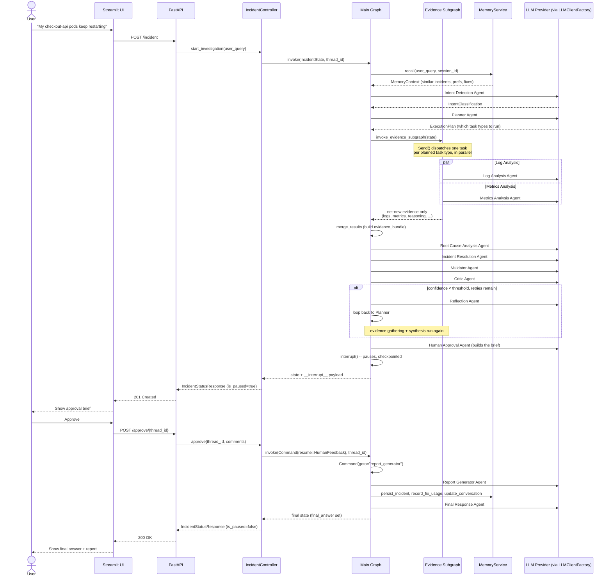

# Sequence Diagram

A full incident lifecycle: creation, the automated evidence-gathering
fan-out, the retry cycle, and human approval -- across the transport,
orchestration, and reasoning layers.

