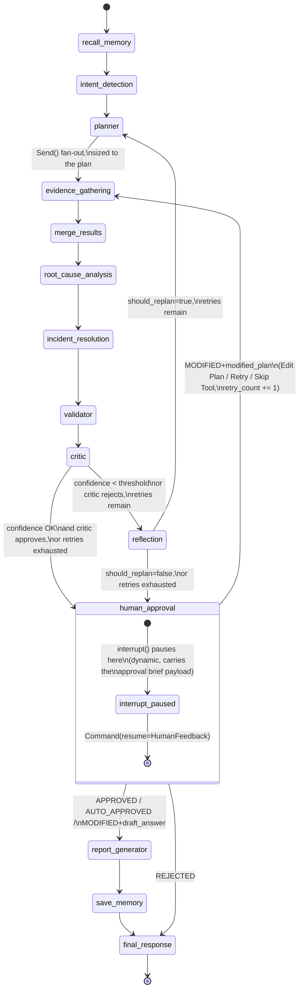

# State Diagram

The compiled graph's node transitions (see
[`../incident_agent/graphs/main_graph.py`](../incident_agent/graphs/main_graph.py)).
`evidence_gathering` is itself a separately-compiled subgraph with its
own internal Send-based fan-out -- see
[`sequence-diagram.md`](sequence-diagram.md) for that detail expanded.

## Retry cycle termination

`retry_count` (state) and `settings.max_replan_attempts` bound the
`critic -> reflection -> planner -> ... -> critic` cycle -- see
[`../incident_agent/edges/confidence_check.py`](../incident_agent/edges/confidence_check.py)
and
[`../incident_agent/edges/reflection_routing.py`](../incident_agent/edges/reflection_routing.py).
Once exhausted, the run always proceeds to `human_approval` regardless
of confidence -- a persistently low-confidence incident still reaches a
human decision point rather than looping forever or silently completing.

## Static interrupts (orthogonal to the diagram above)

`build_incident_graph(interrupt_before=[...], interrupt_after=[...])`
can pause unconditionally before/after any named node, independent of
`human_approval`'s dynamic `interrupt()`. These don't appear in the
diagram above because they're an opt-in compile-time configuration, not
part of the default topology -- see
[`../tests/test_phase8_human_in_the_loop.py`](../tests/test_phase8_human_in_the_loop.py)'s
`TestStaticInterrupts` for both in action.
